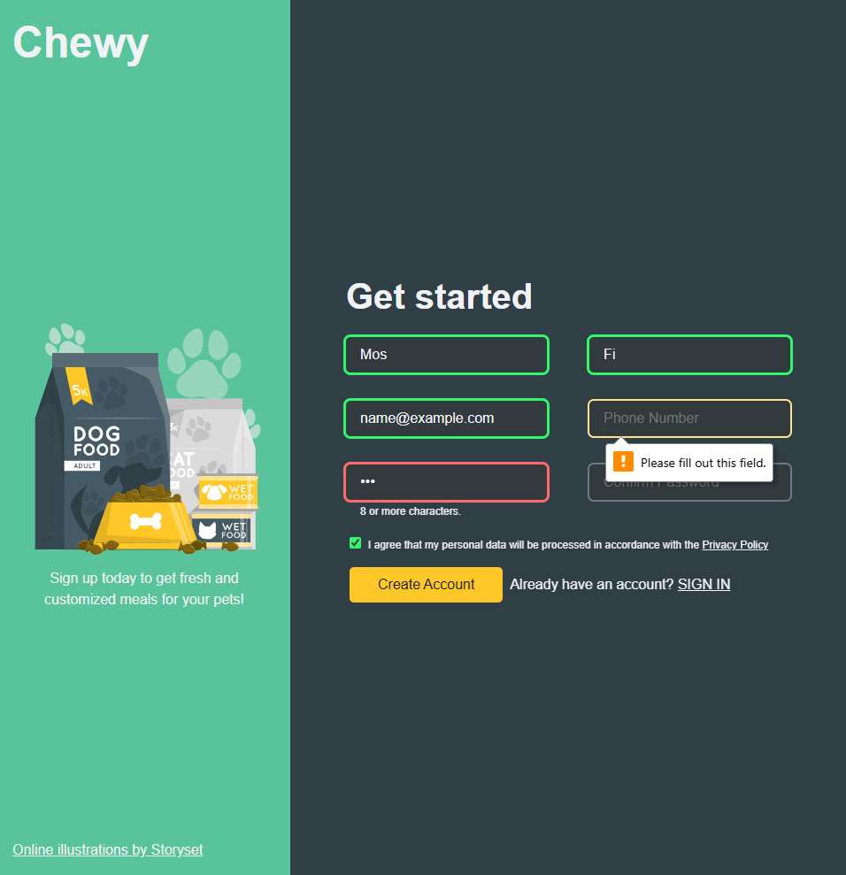

# Sign-up Form

A sign-up form project built for The Odin Project's [Intermediate HTML and CSS Course](https://www.theodinproject.com/lessons/node-path-intermediate-html-and-css-sign-up-form#project-solution).

## Overview

This project demonstrates CSS form styling and validation feedback. I implemented my own design system and pet food service theme rather than following the original design exactly.

CSS-only feedback for valid/invalid inputs (JavaScript validation covered in future lessons)

## Design

- Josh Comeau's CSS reset and contemporary styling practices
- Custom color palette and CSS variables
- Scalable typography system (`--f-xs` to `--f-xl`)
- Consistent spacing scale (`--space-xs` to `--space-xl`)
- Enhanced visual validation states

## Key Technologies

- Semantic HTML5
- CSS3 (Flexbox, Custom Properties, Pseudo-classes)
- CSS-only form validation styling

---

\*Built with ❤️ by mosfi99
